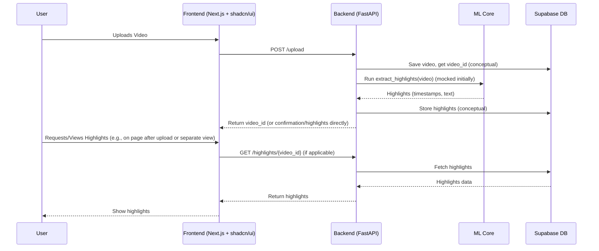

# System Patterns & Architecture

## High-Level Architecture
The system allows users to upload videos via a Next.js frontend. The FastAPI backend handles the upload, stores video metadata in Supabase, and (notionally) triggers an ML core process to extract highlights. These highlights are then stored and can be retrieved by the frontend to display to the user.

The `projectbrief.md` includes a more specific Mermaid diagram for the core video highlight flow:

*(Note: The .clinerules file has a slightly different Mermaid diagram, which is also a good reference. This one is adapted from the projectbrief.md provided in the task.)*

## Key Technical Decisions
Based on `projectbrief.md`:
- **Backend Framework:** FastAPI (Python) for its speed, async capabilities, and automatic docs.
- **Frontend Framework:** Next.js (App Router, TypeScript) for modern React development, SSR/SSG capabilities, and good developer experience.
- **Database & Auth:** Supabase (PostgreSQL) for its integrated database, authentication (OAuth), and ease of use, especially for hackathons. (Auth is optional for MVP).
- **UI Styling:** TailwindCSS for utility-first CSS.
- **UI Components:** shadcn/ui for pre-built, customizable, and accessible React components.
- **Architectural Pattern:** RESTful API for communication between frontend and backend.
- **Development Approach:** Mocking of ML and DB functionalities for initial rapid development ("ship vertical slice").

## Core Component Responsibilities
- **Frontend (Next.js):** User interface for video upload, displaying highlights, and handling user interactions. Communicates with the backend via API calls.
- **Backend (FastAPI):** Handles API requests from the frontend (e.g., video upload, retrieving highlights), interacts with the ML core for video processing, and manages data persistence with Supabase.
- **ML Core:** (Initially mocked) Responsible for the AI/ML logic to analyze video content and extract highlights (e.g., identifying key moments, generating timestamps and captions).
- **Database (Supabase):** Stores video metadata, extracted highlights, and potentially user information (if authentication is implemented).

## Data Flow
**Video Upload & Highlight Extraction (MVP):**
1. User selects a video file in the Frontend.
2. Frontend sends the file to Backend (`POST /upload`).
3. Backend receives the file.
   - (Conceptually) Stores video metadata in Database.
   - Calls ML Core (mocked) to "extract highlights."
4. ML Core (mocked) returns dummy highlight data (timestamps, captions).
   - (Conceptually) Backend stores these highlights in Database.
5. Backend returns a confirmation/ID/highlights to the Frontend.
6. Frontend displays the (mocked) highlights to the User.

*(User authentication flow to be detailed if/when implemented.)*

## Important Interfaces & APIs
**Backend API (as per `projectbrief.md` "What to Build First?"):**
- `POST /backend/api/upload`: Endpoint to upload a video file.
- `GET /backend/api/highlights/{video_id}`: Endpoint to retrieve highlights for a given video (conceptual, may be part of upload response initially).

**External APIs (Supabase):**
- Supabase client library for database interactions and authentication.

*(This file should document the stable and emerging patterns in the system. Update as the architecture evolves.)*
